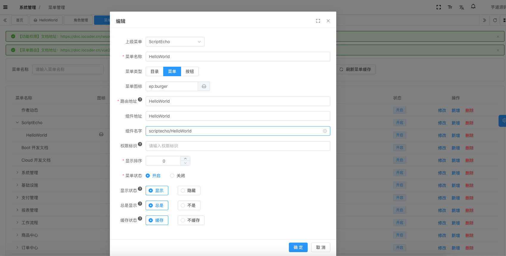

# ScriptEcho Ruoyi 的模板项目

## 安装与使用

- 获取项目代码

```bash
git clone https://github.com/ScriptEcho-ai/ScriptEch-RuoyiTemplate.git
```

- 安装依赖

```bash
yarn install

```

- 运行

```bash
yarn server
```

- 构建

```bash
yarn build
```

## 添加页面

1. 访问 http://localhost:80 进行登录（admin 123456）

2. 创建页面 HelloWorld.vue 到 src/view/scriptecho 下

3. 进入系统设置-菜单管理页面

4. 在 ScriptEcho 菜单下添加子菜单 HelloWolrd 

5. 访问 http://localhost:80/scriptecho/HelloWorld
